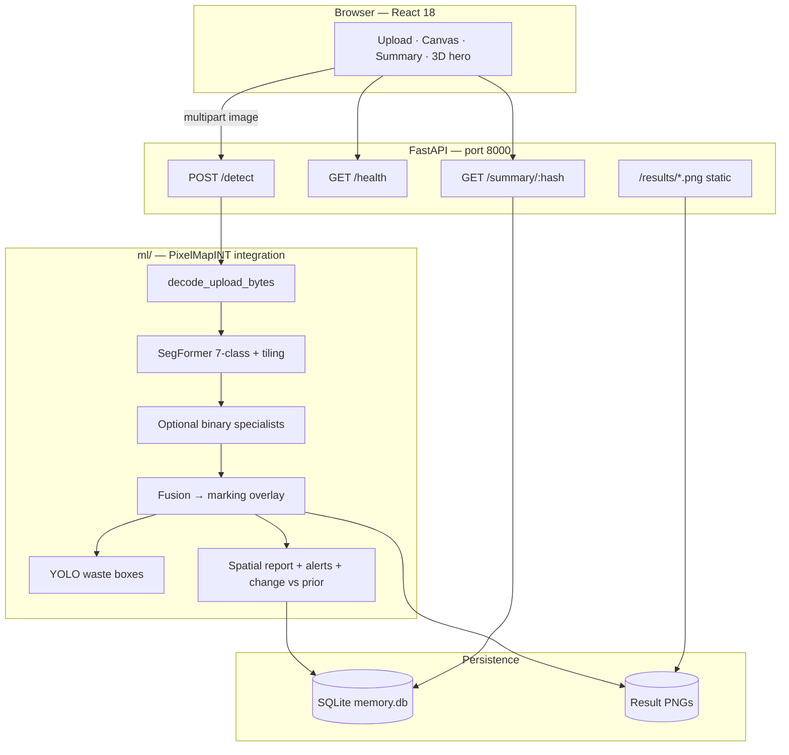

<div align="center">

# InfraSight

### *Geospatial intelligence — perception, reasoning, and memory.*

<br/>

**Turn aerial and satellite imagery into actionable land intelligence:** segmentation, multi-model fusion, analytics, governance-style alerts, and **longitudinal memory** — in one cohesive stack.

<br/>

[](https://www.python.org/)
[](https://fastapi.tiangolo.com/)
[](https://react.dev/)
[](https://pytorch.org/)
[](https://huggingface.co/docs/transformers)

<br/>

[Overview](#-overview) ·
[Why it matters](#-why-it-matters) ·
[Architecture](#-architecture) ·
[Features](#-feature-matrix) ·
[Quick start](#-quick-start) ·
[Configuration](#-model-weights--environment) ·
[API](#-api-reference) ·
[Docs](#-further-reading)

<br/>

</div>

---

## Overview

**InfraSight** is an end-to-end workspace for **geospatial intelligence** from aerial or satellite imagery. It wires together a polished **React** experience, a **FastAPI** inference service, and **PixelMapINT**: a **7-class SegFormer** backbone with optional **binary specialist heads** (building, water, road) plus an advisory **YOLO** waste detector.

The system does not stop at a pretty overlay. It emits a **marking map** (routing-oriented semantics), **structured spatial analytics**, **governance-style alerts**, and **change intelligence** when a new scan shares the same **location fingerprint** as a prior one.

---

## Why it matters

| Stakeholder | What InfraSight surfaces |
|-------------|-------------------------|
| **Operators** | One upload → instant overlay + stats; no GIS toolchain required for a first pass. |
| **Planners** | Land-cover mix, heat-island / green-cover signals, and open-land hints as conversation starters. |
| **Monitoring** | SQLite-backed **timeline** per location; **delta** views when the same footprint is rescanned. |

> **Judge mode:** If you only read one paragraph — InfraSight is *perception + reasoning + memory*: deep models for pixels, rules and rollups for sense-making, and persistence so the story of a place can evolve across uploads.

---

## Architecture



<details>
<summary><strong>Repository map</strong> (click to expand)</summary>

| Path | Role |
|------|------|
| `frontend/` | React 18 UI — upload, marking canvas, summary, Three.js hero; **dev proxy** to the API. |
| `backend/` | `main.py` — FastAPI, CORS, lifespan hooks, `/results` static mount, job orchestration. |
| `backend/memory/` | Fingerprinting + SQLite timeline for `location_hash`. |
| `ml/` | `integration.py` (SegFormer + fusion + YOLO + analytics), `preprocess.py`, shared `requirements.txt`. |
| `model/PixelMapINT/` | Weights, notebooks, deployment helpers, and deep-dive docs. |

</details>

---

## Feature matrix

| Capability | Detail |
|------------|--------|
| **Semantic land-cover** | Urban, agricultural, open/rangeland, forest, water, barren, unknown — mapped to a **routing-style marking layer** (clear vs vegetation vs water vs built). |
| **Multi-model fusion** | Optional **building** / **water** binary SegFormers refine the semantic map; **roads** render as **routable (clear)** on the marking overlay. |
| **Waste advisory** | When `best.pt` is present, **YOLO** draws red advisory boxes; hits fold into **spatial alerts**. |
| **Spatial intelligence** | Coverage %, estimated areas (~**0.5 m GSD** assumption in analytics), **connected-component** patch counts, governance-style rules. |
| **Temporal memory** | Same **`location_hash`** → automatic **class-coverage change** report vs the previous scan. |

---

## Quick start

### Prerequisites

- **Python 3.10+** (PyTorch + Transformers friendly)
- **Node.js 18+** + npm
- **NVIDIA GPU** optional — CUDA is picked up automatically when available

### 1 · Backend (API + ML)

```bash
cd backend
python3 -m venv .venv
source .venv/bin/activate   # Windows: .venv\Scripts\activate
pip install -r requirements.txt
./run_dev.sh
```

API base: **http://127.0.0.1:8000** (hot reload enabled).

<details>
<summary><strong>Alternative — explicit uvicorn</strong> (if <code>uvicorn</code> is not on PATH)</summary>

```bash
.venv/bin/python -m uvicorn main:app --reload --port 8000 --host 127.0.0.1 \
  --reload-exclude 'venv/*' --reload-exclude '.venv/*' \
  --reload-exclude '*/site-packages/*' --reload-exclude 'data/results/*'
```

</details>

### 2 · Frontend (UI)

```bash
cd frontend
npm install
npm start
```

Open **http://localhost:3000** — the app **proxies** `/detect`, `/summary`, `/health`, and `/results` to `127.0.0.1:8000`. **Start the backend first.**

### Production build

```bash
cd frontend && npm run build
```

Serve `frontend/build/` behind your reverse proxy and route API traffic to FastAPI, or adjust base URLs for your host.

---

## Model weights & environment

Default checkpoints live under **`model/PixelMapINT/model/`**:

| Asset | Default file | Override |
|-------|----------------|----------|
| Main 7-class SegFormer | `segformer_spatial_model.pth` | `ML_SEGFORMER_WEIGHTS` |
| Building specialist | `building_segformer.pth` | `ML_BUILDING_SEGFORMER_WEIGHTS` |
| Road specialist | `road_segformer.pth` | `ML_ROAD_SEGFORMER_WEIGHTS` |
| Water specialist | `water_segformer.pth` | `ML_WATER_SEGFORMER_WEIGHTS` |
| Waste (YOLO) | `best.pt` | `ML_WASTE_YOLO_WEIGHTS` |

- **Hugging Face** pulls `nvidia/segformer-b0-finetuned-ade-512-512` into **`.hf_cache/`** at repo root on first inference.
- **`ML_TILE_GRID`** (default **`2`**) — N×N tiling: each tile runs SegFormer; outputs are **stitched** for sharper large-image detail.

If the **main** weights file is absent, the API still answers but **skips** finetuned inference and omits the overlay until weights are placed.

---

## API reference

| Method | Path | Purpose |
|--------|------|---------|
| `GET` | `/health` | Liveness + ML weight discovery / load hints. |
| `POST` | `/detect` | Multipart field **`image`** — returns JSON + `result_url` to marking PNG when inference succeeds. |
| `GET` | `/summary/{location_hash}` | Timeline + latest analytics for that fingerprint. |
| `GET` | `/results/{job_id}.png` | Served marking map (files under `backend/data/results/`). |

---

## Location fingerprinting & change detection

| Behavior | Mechanism |
|----------|-----------|
| **Default fingerprint** | SHA-256 of raw bytes → `loc_<24-char hex>` |
| **Demo shortcut** | Filename contains **`demo`** or **`delhi`** → fixed hash **`demo_delhi_001`** so judges can **rescan** and see **`change_detection`** instantly. |
| **Change signal** | Before inference, latest prior payload for that hash is loaded; **land-cover % deltas** drive the change report and alerts. |

Persistent scans: **`backend/data/memory.db`** (typically gitignored — clone fresh → empty DB).

---

## Further reading

| Document | Contents |
|----------|----------|
| [`model/PixelMapINT/README.md`](model/PixelMapINT/README.md) | Origin story, feature narrative, pipeline overview. |
| [`model/PixelMapINT/model/INSTRUCTIONS.md`](model/PixelMapINT/model/INSTRUCTIONS.md) | Fusion order, specialist contracts, analytics conventions. |

---

## Disclaimer

InfraSight outputs are **research and decision-support aids**, not certified surveying, cadastral truth, or regulatory sign-off. Validate anything safety- or legally material with **field verification** and **authoritative GIS**.

---

<div align="center">

**Built for clarity under pressure — pixels in, intelligence out.**

</div>
